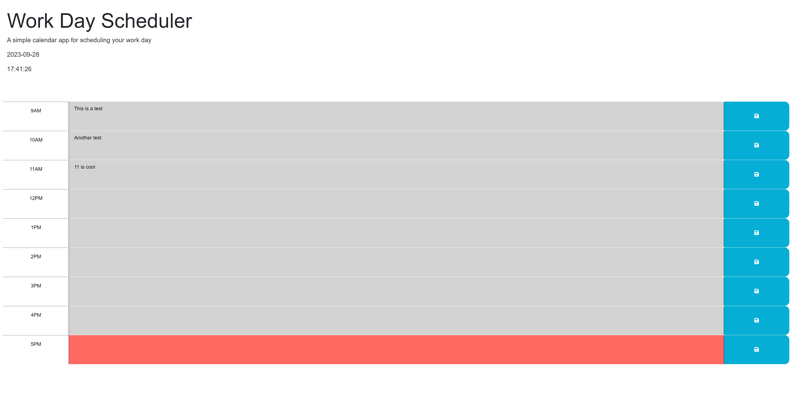

# <Work-Day-Planner>

## Description

This is a webpage that displays a block of 9 hours for the standard 9-5 workday. It is setup to track the current date and time and color code the hour blocks accordingly. You can save data in the hour blocks that will persist through local storage.
This was a cool project because it allowed me to get more familiar with Jquery syntax and also gave me experience using dayjs. It was also an opportunity for more experience using local storage. Overall, this project was a good learning opportunity.

## Installation

Github Pages link: https://conorreed.github.io/work-day-planner/


## Usage


    ```md
    
    ```

## Credits

I was able to build out the JavaScript functions with the help of my dad. Big thanks to him.

## License

Refer to the licensce section.
